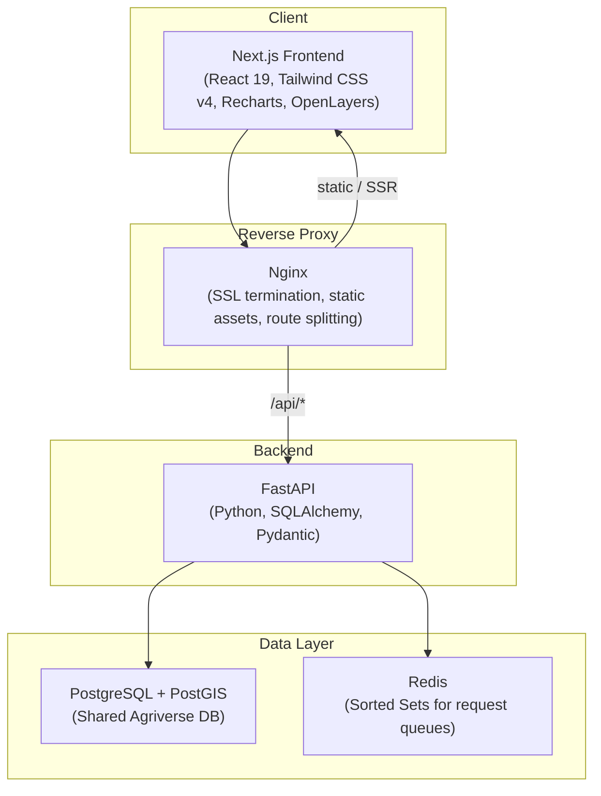
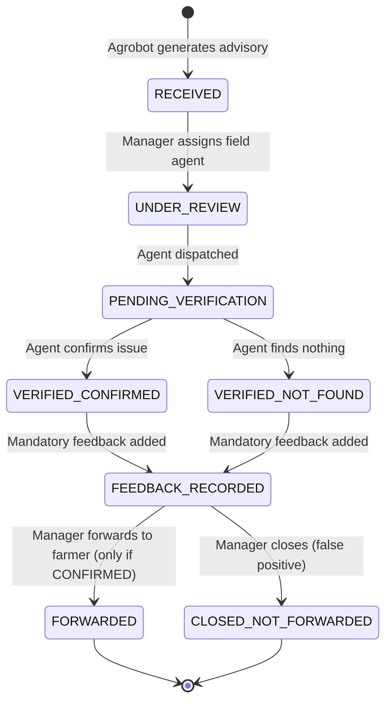
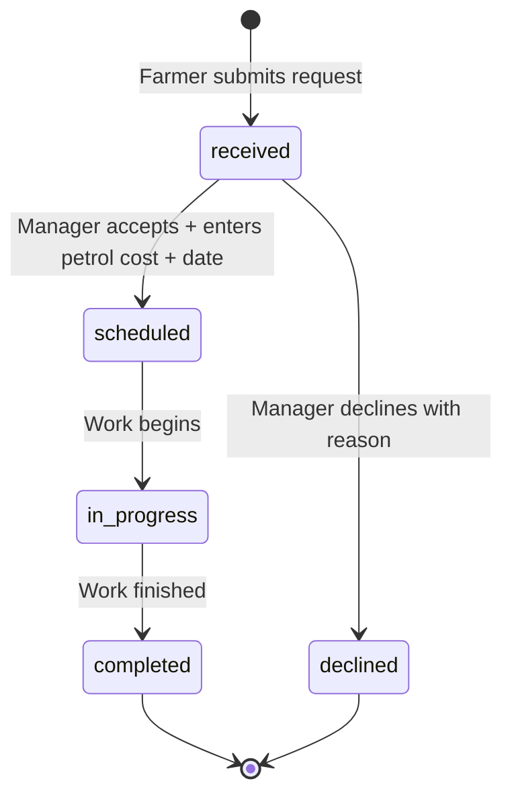

# FAMS — Full Technical Specification
**Version 1.0 — 21 July 2026**

---

## Table of Contents
1. [System Purpose & Context](#1-system-purpose--context)
2. [Architecture Overview](#2-architecture-overview)
3. [Tech Stack](#3-tech-stack)
4. [User Roles & Personas](#4-user-roles--personas)
5. [Data Model — Farm Registry](#5-data-model--farm-registry)
6. [Database Schema — New FAMS Tables](#6-database-schema--new-fams-tables)
7. [State Machines](#7-state-machines)
8. [Business Rules (BR-1 through BR-6)](#8-business-rules-br-1-through-br-6)
9. [Frontend — Screen-by-Screen Specification](#9-frontend--screen-by-screen-specification)
10. [FastAPI Backend — Full Endpoint Specification](#10-fastapi-backend--full-endpoint-specification)
11. [Redis Caching & Queuing Strategy](#11-redis-caching--queuing-strategy)
12. [Background Jobs](#12-background-jobs)
13. [Authentication & Authorization](#13-authentication--authorization)
14. [Deployment Topology (Docker / Nginx)](#14-deployment-topology-docker--nginx)
15. [Implementation Roadmap](#15-implementation-roadmap)
16. [Open Questions](#16-open-questions)

---

## 1. System Purpose & Context

FAMS (**Farmer Advisory Management System**) is a **human-in-the-loop middleware platform** that sits between three external systems:

```mermaid
graph LR
    A["Agrobot AI<br/>(Satellite advisory engine)"] -->|Raw advisories| B["FAMS<br/>(This system)"]
    B -->|Verified advisories| C["Farmer App<br/>(End consumer)"]
    D["Field Agent App<br/>(Ground-truth)"] -->|Verification reports| B
    B -->|Task assignments| D
    C -->|Service requests<br/>(tractors, drones)| B
    B -->|Feedback loop| A
```

**The core workflow:**
1. **Agrobot** analyses satellite imagery (NDVI, NDMI, etc.) and detects crop anomalies on registered farms.
2. **FAMS** receives these raw advisories and routes them to a **Service Center Manager** (e.g., Ayesha Khan at Layyah Center).
3. The Manager assigns a **Field Agent** to physically visit the farm and verify the issue.
4. The Field Agent records their ground-truth observation (confirmed or not found).
5. The Manager records **mandatory feedback** (explaining why the AI was right or wrong).
6. If confirmed, the advisory is **forwarded to the Farmer** via the Farmer App.
7. If not confirmed (false positive), it is **closed** — and the feedback is **returned to Agrobot** so the AI can learn.
8. Separately, farmers can submit **service requests** (tractor, drone, harvester) which the Manager prices and schedules.

> [!IMPORTANT]
> FAMS is a **standalone application** that connects to the **existing Agriverse PostgreSQL database**. The database schema cannot be destructively changed — all modifications are **additive only** (new tables, new nullable columns, new enums).

---

## 2. Architecture Overview



| Layer | Responsibility |
| :--- | :--- |
| **Nginx** | Receives all traffic. Routes `/api/*` to FastAPI. Routes everything else to Next.js. Handles SSL. |
| **Next.js** | Renders all UI screens. Currently uses mock data in `src/lib/data.js` and `src/lib/store.jsx`. Will be refactored to call FastAPI endpoints via `fetch()`. |
| **FastAPI** | All business logic, state-machine enforcement (BR-1 through BR-6), data validation (Pydantic), and database access (SQLAlchemy). |
| **PostgreSQL** | Single source of truth. Shared with Agriverse. FAMS adds new tables but never drops or alters existing ones. |
| **Redis** | Service request queue (Sorted Sets scored by timestamp — oldest first). Optional: advisory cache. |

---

## 3. Tech Stack

| Component | Technology | Version | Purpose |
| :--- | :--- | :--- | :--- |
| Frontend Framework | Next.js (App Router) | 16.2.3 | Server/client rendering, file-based routing |
| UI Library | React | 19.2.0 | Component architecture |
| Styling | Tailwind CSS | 4.x | Utility-first CSS (dark theme, Agriverse design language) |
| Charts | Recharts | 3.4.1 | Bar charts, line charts, tooltips |
| Maps | OpenLayers (`ol`) | 10.7.0 | Satellite imagery tiles (Esri), farm boundary polygons, pin overlays |
| Fonts | Inter (Google Fonts) | — | UI typography (weights 300–700) |
| Backend | FastAPI (Python) | Latest | REST API, Pydantic validation, auto-docs (Swagger) |
| ORM | SQLAlchemy | Latest | Database reflection & models (no migrations — Prisma owns the schema) |
| Database | PostgreSQL + PostGIS | — | Shared Agriverse database |
| Cache / Queue | Redis | Latest | Sorted Sets for service request ordering |
| Reverse Proxy | Nginx | Latest | Route splitting, SSL, static serving |
| Container | Docker + docker-compose | — | Local development and deployment |

---

## 4. User Roles & Personas

| Role | Persona (prototype) | Access Level | Primary Screens |
| :--- | :--- | :--- | :--- |
| `SERVICE_CENTER_MANAGER` (SCM) | Ayesha Khan — Layyah Center | Full read/write on own service center's farms, advisories, requests, agents | `/dashboard`, `/advisories`, `/advisories/[farmId]`, `/services`, `/agents`, `/leaderboard` |
| `CHIEF_AGRONOMIST` (CA) | Dr. Imran Sethi | Read-only oversight across ALL service centers | `/overview` |
| `FIELD_AGENT` (FA) | Mustafa Kamal, Tariq Jamil, etc. | Submit verifications for assigned cases only | Agent app (external) — submits via API |
| `PROGRESSIVE_FARMER` | — | Submit service requests, receive forwarded advisories | Farmer App (external) — consumes via API |
| `ADMIN` | — | Full system access | All endpoints |

**Login flow (current prototype):** Role selection on `/login` — no password. Will be replaced with JWT authentication against the Agriverse `User` table.

---

## 5. Data Model — Farm Registry

The farm registry is sourced from `farms.json` (120 surveyed fields from Sheikhupura & Layyah districts in Punjab, Pakistan). Each farm record contains:

| Field | Type | Example | Description |
| :--- | :--- | :--- | :--- |
| `id` | string | `"farm-1"` | Unique identifier |
| `sNo` | int | `1` | Serial number from survey |
| `farmer` | string | `"Bilal Khaleel"` | Farmer's name |
| `village` | string | `"Nangal Sahdan"` | Village name |
| `phone` | string | `"0309-4980501"` | Contact number |
| `boundary` | `[[lon, lat], ...]` | — | GeoJSON-style polygon (closed ring) |
| `lon`, `lat` | float | `74.254, 31.849` | Centroid coordinates |
| `acres` | float | `10.0` | Farm area |
| `irrigation` | string[] | `["Canal"]` | Irrigation methods |
| `crop` | string | `"Rice"` | Current crop |
| `variety` | string | `"1847"` | Crop variety |
| `sowDate` | string | `"2025-04-11"` | Sowing date |
| `harvestDate` | string | `"2025-10-30"` | Expected harvest |
| `condition` | enum | `"Good"` / `"Average"` / `"Bad"` | Crop condition from survey |
| `fertilizer` | object | `{name, qty, date}` | Last fertilizer application |
| `pesticide` | object | `{name, qty, date}` | Last pesticide application |
| `disease` | object | `{issues, outbreak, severity, from, to}` | Disease/pest status |
| `yieldExpected` | int | `40` | Expected yield (mounds) |
| `yieldActual` | int | `45` | Actual yield (mounds) |
| `nextCrop` | string | `"Wheat"` | Planned next crop |

**Geo clustering:** Farms with `lon < 72.5` are classified as **Layyah** district; others as **Sheikhupura**. Service center assignment is derived from district.

---

## 6. Database Schema — New FAMS Tables

> [!NOTE]
> These tables are **additive** to the existing Agriverse Postgres database. They were deployed via `npx prisma db push`. FastAPI will access them via SQLAlchemy models that mirror the Prisma schema exactly.

### 6.1 New Tables

| Table | Purpose | Key Columns |
| :--- | :--- | :--- |
| `ServiceCenter` | Regional office managing a set of farms/agents | `id`, `name`, `district`, `location` |
| `Cycle` | 5-day recurring advisory window | `id`, `startDate`, `endDate`, `status` |
| `AdvisoryCase` | Core workflow object — one case per Agrobot advisory | `id`, `cycleId`, `farmId`, `fieldCropId`, `sourceAdvisoryId`, `kind`, `issueType`, `severity`, `state`, `assignedAgentId` |
| `AdvisoryVerification` | Field agent's ground-truth report | `id`, `caseId`, `agentId`, `outcome` (CONFIRMED/NOT_FOUND), `notes`, `verifiedAt` |
| `AdvisoryFeedback` | Mandatory feedback per case | `id`, `caseId`, `recordedById`, `text`, `recordedAt` |
| `AdvisoryForwarding` | Record: case forwarded to farmer/Agrobot | `id`, `caseId`, `forwardedById`, `forwardedAt`, `agrobotRefId` |
| `AdvisoryClosure` | Record: case closed without forwarding | `id`, `caseId`, `closedById`, `reason`, `closedAt` |
| `AdvisoryEvent` | Audit trail — one row per state transition | `id`, `caseId`, `actorId`, `fromState`, `toState`, `note`, `createdAt` |
| `Broadcast` | Push message to farmers (district/center/national) | `id`, `title`, `body`, `category`, `districtId`, `serviceCenterId`, `sentAt` |
| `WeatherAlert` | District-scoped weather/pest/disease alert | `id`, `districtId`, `alertType`, `severity`, `message`, `validFrom`, `validTo` |

### 6.2 New Enums

| Enum | Values |
| :--- | :--- |
| `FieldAgentAvailability` | `AVAILABLE`, `BUSY`, `OFF_DUTY` |
| `AdvisoryCaseKind` | `FARM_LEVEL`, `WEATHER`, `GENERAL` |
| `IssueType` | `PEST`, `DISEASE`, `NUTRIENT`, `IRRIGATION`, `WEATHER`, `OTHER` |
| `AdvisorySeverity` | `LOW`, `MODERATE`, `HIGH`, `CRITICAL` |
| `AdvisoryCaseState` | `RECEIVED`, `UNDER_REVIEW`, `PENDING_VERIFICATION`, `VERIFIED_CONFIRMED`, `VERIFIED_NOT_FOUND`, `FEEDBACK_RECORDED`, `FORWARDED`, `CLOSED_NOT_FORWARDED` |
| `VerificationOutcome` | `CONFIRMED`, `NOT_FOUND` |
| `BroadcastCategory` | `ADVISORY`, `WEATHER`, `SCHEME`, `GENERAL` |

### 6.3 Modified Existing Tables (Additive Columns Only)

| Table | Added Fields | Purpose |
| :--- | :--- | :--- |
| `User` | `serviceCenterId`, `availabilityStatus` | Link agents/managers to a service center; track duty status |
| `Farm` | `serviceCenterId` | Scope farms to a service center |
| `ServiceRequest` | `basePrice`, `petrolCost`, `totalCost`, `scheduledFor`, `completedAt`, `declineReason`, `handledById` | Manager-entered pricing, scheduling, completion tracking |

---

## 7. State Machines

### 7.1 Advisory Case Lifecycle



> [!CAUTION]
> The **schema allows any state transition** — it is NOT enforced at the database level. The state-machine rules MUST be enforced in the FastAPI controller logic for `/forward` and `/close` endpoints. This is the single most critical correctness requirement.

### 7.2 Service Request Lifecycle



**Pricing rule:** `totalCost = basePrice (fixed per service type) + petrolCost (manually entered by manager per request)`. Advisories are always free.

---

## 8. Business Rules (BR-1 through BR-6)

These are the **non-negotiable rules** that must be enforced by the backend:

| Rule | Description | Where Enforced |
| :--- | :--- | :--- |
| **BR-1** | An advisory can **only be forwarded** to the farmer if its verification outcome is `VERIFIED_CONFIRMED`. A `RECEIVED` or `PENDING_VERIFICATION` advisory cannot be forwarded — the "Forward" button is disabled in the UI. | `POST /api/advisory-case/:id/forward` — reject if state ≠ VERIFIED_CONFIRMED |
| **BR-2** | **Feedback is mandatory** for every case, regardless of verification outcome (confirmed or not_found). The forward and close actions are blocked until feedback exists. | `POST /api/advisory-case/:id/forward` and `/close` — reject if no `AdvisoryFeedback` row exists |
| **BR-4** | A case closed as `CLOSED_NOT_FORWARDED` (e.g., false positive) can **never be sent** to the farmer. The "Forward" action is permanently removed. | `POST /api/advisory-case/:id/forward` — reject if state = `CLOSED_NOT_FORWARDED` |
| **BR-5** | **Every action** appears in the audit timeline with the actor's identity and a timestamp. | Every state-changing endpoint writes an `AdvisoryEvent` row |
| **BR-6** | Once feedback is recorded, it is **automatically returned to Agrobot** so the advisory engine can learn from verification outcomes. A "Feedback returned to Agrobot" chip is displayed. | `POST /api/advisory-case/:id/feedback` — sets `returnedToAgrobot = true` and writes an event |

---

## 9. Frontend — Screen-by-Screen Specification

The frontend is a **Next.js App Router** application using the Agriverse design language (Inter font, dark theme `#0a0b0e`, green accent `#4caf50`).

### 9.1 `/login` — Role Selection
- **File:** [page.jsx](file:///c:/Users/user/Desktop/densefusion/FAMS/src/app/login/page.jsx)
- **Purpose:** Entry point. User picks a role (no password in prototype).
- **UI:** Two large clickable cards:
  - **Service Center Manager** (Ayesha Khan — Layyah Center) → redirects to `/dashboard`
  - **Chief Agronomist** (Dr. Imran Sethi) → redirects to `/overview`
- **Backend integration:** Will become a real login form posting to `POST /api/auth/login`, receiving a JWT.

---

### 9.2 `/dashboard` — Manager Morning Dashboard
- **File:** [page.jsx](file:///c:/Users/user/Desktop/densefusion/FAMS/src/app/dashboard/page.jsx) (~417 lines)
- **Purpose:** The manager's daily command center.
- **UI Layout:**

#### KPI Tiles (4 across the top)
| Tile | Value | Sub-text |
| :--- | :--- | :--- |
| Farms | Count of farms in this center | Total acres under monitoring |
| Today's advisories | Farm-level + general count | X to verify, Y pending |
| Verification progress | Verified / total | Forwarded, false positives, "feedback returned to Agrobot" |
| Implement requests | Open count | Completed, earned (Rs.), pipeline value |

#### Farm Map (OpenLayers, left 65%)
- **Tiles:** Esri World Imagery satellite base layer.
- **Three switchable views:**
  - **Farm-level:** Color-coded pins (🔴 problem, 🟠 moderate, 🟢 healthy) based on advisory severity and crop condition.
  - **Weather:** Each pin shows a weather icon from `/weather-icons/*.svg`.
  - **General:** All pins teal — indicates broadcast reach.
- **Interaction:** Click a pin → right panel shows farm detail (farmer name, crop, advisory status, weather advisory). Click "View full details" → navigates to `/advisories/[farmId]`.
- **Hover tooltip:** Shows farmer name + village on pin hover.

#### Action Queue (right 35%)
- Combined list of:
  - Advisories needing verification (amber left border)
  - Open service requests (blue left border)
- Searchable by farmer name.

#### Trend Charts (bottom row, 2 charts)
- **Advisories this cycle:** Stacked bar chart (farm-level / general / weather) by cycle day.
- **Implement earnings:** Line chart of last 6 months in Rs.

---

### 9.3 `/advisories` — Farms Table + General Advisories
- **File:** [page.jsx](file:///c:/Users/user/Desktop/densefusion/FAMS/src/app/advisories/page.jsx)
- **Purpose:** Tabular view of all farms with their advisory status.
- **UI:**
  - **General advisories strip** (collapsible): 5 cards in a grid showing district-wide broadcasts (heat advisory, rain outlook, jassid alert, canal closure, mandi prices).
  - **Farms table** (sortable, filterable):
    - Columns: Farmer, Village, Area (acres), Advisory type (farm-level / general only), Total advisories (current + historical), Recent advisory issue type, Status badge, View button.
    - Filters: text search (farmer/village), type filter (farm-level/general), state filter (received/pending/verified/closed/needs action).
    - Active advisories are highlighted with a left amber box-shadow.

---

### 9.4 `/advisories/[farmId]` — Farm Detail Page
- **File:** [page.jsx](file:///c:/Users/user/Desktop/densefusion/FAMS/src/app/advisories/%5BfarmId%5D/page.jsx) (~381 lines)
- **Purpose:** The core workflow screen where the manager acts on advisories.
- **UI Layout (3-column grid):**

#### Left Column: Farm & Crop Profile
- Key-value pairs: Farmer, Phone, Village, Area, Irrigation, Crop, Variety, Sown, Expected harvest, Yield (expected/actual), Next crop.

#### Center Column: Latest Advisory + Inputs & Risks
- **Advisory card** (the most critical UI element):
  - Shows: issue type, severity badge, status badge, full advisory text, cycle info, index layer, affected area percentage.
  - **Action buttons change based on state:**
    - `received` → **"Send to Field Agent"** button (opens assign modal)
    - `pending_verification` → **"Record Verification & Feedback"** button (opens verify modal)
    - `verified` → **"Forward to Farmer"** (enabled only if BR-1 met) + **"Close — Do Not Forward"**
    - `closed` → Terminal state message
  - If verified: shows green/red verification outcome box with agent observations, feedback, and "Feedback returned to Agrobot" teal badge.
- **Inputs & Risks card:** Fertilizer and pesticide details from survey. Disease outbreak alert (red/green).

#### Right Column: Weather + Advisory History
- **Weather card:** Current temp, wind, humidity, rain %. 6-day forecast grid.
- **Advisory history:** Scrollable list of past-cycle advisories for this farm (issue type, cycle number, truncated text, forwarded/closed badge, verifying agent name).

#### Bottom Row (3-column)
- **Index values by growth stage:** Line chart comparing Actual vs Reference for the selected vegetation index (NDVI, NDMI, EVI, MSAVI, NDRE, NDWI, NBR). 7 growth stages: Seedling → Maturity.
- **Index classification:** Bar chart (Open Soil / Sparse / Moderate / Dense) with color coding.
- **Audit timeline:** Vertical timeline with green dots showing every event: "Advisory received" (by Agrobot), "Field agent assigned", "Verified — issue confirmed/not found", "Feedback recorded", "Feedback returned to Agrobot", "Forwarded to farmer" / "Closed — not forwarded".

#### Satellite Map
- **Field mode:** Shows the farm's boundary polygon with a semi-transparent index overlay and a red stress patch in a sub-area.
- **Index selector:** 7 buttons (NDVI, NDMI, EVI, MSAVI, NDRE, NDWI, NBR) — each changes the overlay color.
- **Imagery timeline:** 10 date buttons from 2026-05-30 to 2026-07-14 (latest).

#### Modals (4 workflow modals)
1. **Assign Agent:** Dropdown of agents (name + status). Button: "Assign & mark Pending Verification".
2. **Record Verification & Feedback:** Two toggle buttons (✓ Issue confirmed / ✗ Issue not found), observations textarea, mandatory feedback textarea, optional false-positive reason field. Button: "Save verification & feedback".
3. **Forward to Farmer:** Optional annotation textarea. Button: "Send to [farmer name]".
4. **Close Advisory:** Closure reason input (required). Button: "Close advisory" (danger style).

---

### 9.5 `/services` — Service Request Queue
- **File:** [page.jsx](file:///c:/Users/user/Desktop/densefusion/FAMS/src/app/services/page.jsx)
- **Purpose:** Manage implement and drone requests from the Farmer App.
- **KPI strip:** Open requests, Completed this month, Earned (completed total in Rs.), Pipeline (open value in Rs.).
- **Request table:** Farmer, Service, Type (drone/implement badge), Requested date, Base price, Petrol cost ("to be added" if null), Total, Status badge, Manage button.
- **Manage panel (sticky sidebar):**
  - For `received`: Petrol cost input + date picker → "Accept & schedule". Decline reason input + "Decline" button.
  - For `scheduled`/`in_progress`: Update petrol cost input. "Mark In Progress" / "Mark Completed" buttons.
  - For `completed`/`declined`: Terminal state message.

---

### 9.6 `/agents` — Field Agents
- **File:** [page.jsx](file:///c:/Users/user/Desktop/densefusion/FAMS/src/app/agents/page.jsx)
- **Purpose:** View field agents and their assigned tasks.
- **UI:** Expandable table. Each agent row shows: name, phone, availability badge (Available/On assignment), active task count, completed today count. Click row → expands to show task list (pending visit / completed badges, farm name, issue type, "Open advisory" button).

---

### 9.7 `/leaderboard` — Performance Rankings
- **File:** [page.jsx](file:///c:/Users/user/Desktop/densefusion/FAMS/src/app/leaderboard/page.jsx) (~273 lines)
- **Purpose:** Gamified farmer performance comparison.
- **Three views:** Farmers, Villages, Crops (toggle buttons).
- **Scoring formula:** `score = 40% yield_efficiency + 25% satellite_health (avg NDVI) + 20% crop_condition + 15% advisory_response`
- **Farmers view:** Top 3 podium cards (gold/silver/bronze styling) + full ranked table (Rank, Farmer, Village, Crop, Acres, Yield eff%, Yield/acre, NDVI, Response%, Score).
- **Villages view:** Bar chart of average score by village + ranked table.
- **Crops view:** Crop comparison cards + bar chart (yield efficiency vs overall score).

---

### 9.8 `/overview` — Chief Agronomist Portal
- **File:** [page.jsx](file:///c:/Users/user/Desktop/densefusion/FAMS/src/app/overview/page.jsx) (~263 lines)
- **Purpose:** Read-only org-wide oversight across all 3 service centers.
- **KPI tiles:** Centers & farms, Advisories this cycle, Implement earnings (month), Service requests.
- **Center comparison table (sortable):** Service center name (+ manager), Farms, Advisories (+ forwarded count), Verify rate %, False positive rate %, Overdue count, Requests open (+ done), Implement earnings. "Drill down" button → expands to show top 8 farms in that center.
- **Trend charts (3 across bottom):**
  - **False-positive rate per cycle** — "Is Agrobot learning?" (org-wide vs best center, line chart).
  - **Implement earnings per center** — 6-month multi-line chart (Layyah, Sheikhupura, Muridke).
  - **Avg request turnaround by service type** — Horizontal bar chart (days).

---

## 10. FastAPI Backend — Full Endpoint Specification

### 10.1 Service Centers — `/api/service-center`

| Method | Path | Purpose | Roles | Request Body | Response |
| :--- | :--- | :--- | :--- | :--- | :--- |
| `POST` | `/` | Create a service center | ADMIN | `{name, district, location}` | `ServiceCenter` |
| `GET` | `/` | List all centers | ADMIN, SCM, CA | — | `ServiceCenter[]` |
| `GET` | `/:id` | Get one center + farms + agents | ADMIN, SCM, CA | — | `ServiceCenter` (populated) |
| `PUT` | `/:id` | Update center details | ADMIN | `{name?, district?, location?}` | `ServiceCenter` |
| `PATCH` | `/:id/farms` | Assign farms to this center | ADMIN, SCM | `{farmIds: string[]}` | `{updated: int}` |
| `PATCH` | `/:id/agents` | Assign agents to this center | ADMIN, SCM | `{agentIds: string[]}` | `{updated: int}` |

---

### 10.2 Advisory Cases — `/api/advisory-case`

| Method | Path | Purpose | Roles | Key Business Logic |
| :--- | :--- | :--- | :--- | :--- |
| `POST` | `/cycles/generate` | Open new 5-day cycle, create cases from Agrobot output | ADMIN, CA | Ingests Agrobot advisories since last cycle |
| `GET` | `/` | List/filter cases | SCM, CA, FA (own), ADMIN | Filter by `serviceCenterId`, `state`, `severity`, `assignedAgentId` |
| `GET` | `/:id` | Case detail + full event history | SCM, CA, FA (own), ADMIN | — |
| `PATCH` | `/:id/assign` | Assign to field agent | SCM, ADMIN | State → `UNDER_REVIEW`. Writes `AdvisoryEvent`. |
| `POST` | `/:id/verification` | Agent submits verification | FA (assignee only) | Outcome: CONFIRMED or NOT_FOUND. State → `VERIFIED_*`. Writes `AdvisoryEvent` + `AdvisoryVerification`. |
| `POST` | `/:id/feedback` | Record mandatory feedback | FA, SCM | **BR-2:** Blocks forward/close until present. State → `FEEDBACK_RECORDED`. Writes `AdvisoryEvent` + `AdvisoryFeedback`. Sets `returnedToAgrobot = true` (BR-6). |
| `POST` | `/:id/forward` | Forward to farmer via Farmer App | SCM, CA | **BR-1 + BR-4:** Server MUST reject unless state = `VERIFIED_CONFIRMED` AND feedback exists. State → `FORWARDED`. Writes `AdvisoryEvent` + `AdvisoryForwarding`. |
| `POST` | `/:id/close` | Close without forwarding | SCM, CA | Requires feedback exists. State → `CLOSED_NOT_FORWARDED`. Writes `AdvisoryEvent` + `AdvisoryClosure`. |
| `GET` | `/:id/events` | Audit trail for one case | SCM, CA, ADMIN | — |

---

### 10.3 Field Agent Operations

| Method | Path | Purpose | Roles |
| :--- | :--- | :--- | :--- |
| `PATCH` | `/api/users/:id/availability` | Set agent availability (AVAILABLE/BUSY/OFF_DUTY) | FA (self), SCM, ADMIN |
| `GET` | `/api/users/field-agents?serviceCenterId=` | List agents for assignment UI | SCM, ADMIN |
| `GET` | `/api/leaderboard?serviceCenterId=&period=` | Agent performance stats | SCM, CA, ADMIN |

---

### 10.4 Service Request Extensions — `/api/service/requests`

| Method | Path | Purpose | Roles |
| :--- | :--- | :--- | :--- |
| `PATCH` | `/:id/cost` | Manager enters `petrolCost`; server calculates `totalCost = basePrice + petrolCost` | SCM, ADMIN, FA |
| `PATCH` | `/:id/schedule` | Set `scheduledFor` date and `handledById` | SCM, ADMIN |
| `PATCH` | `/:id/complete` | Set `completedAt`, mark `COMPLETED` | SCM, FA, ADMIN |
| `PATCH` | `/:id/decline` | Set `declineReason`, mark `REJECTED` | SCM, ADMIN |
| `GET` | `/service-center/:id` | Requests scoped to one service center | SCM, ADMIN |

---

### 10.5 Broadcasts — `/api/broadcast`

| Method | Path | Purpose | Roles |
| :--- | :--- | :--- | :--- |
| `POST` | `/` | Create a broadcast | SCM, CA, ADMIN |
| `GET` | `/` | List broadcasts (filterable by district/center) | All authenticated |
| `POST` | `/:id/send` | Publish to target scope | SCM, CA, ADMIN |
| `DELETE` | `/:id` | Retract unsent broadcast | CA, ADMIN |

---

### 10.6 Weather Alerts — `/api/weather-alert`

| Method | Path | Purpose | Roles |
| :--- | :--- | :--- | :--- |
| `POST` | `/` | Create district-scoped alert | SCM, CA, ADMIN |
| `GET` | `/district/:districtId` | Active alerts for a district | All authenticated |
| `PATCH` | `/:id` | Update alert | SCM, CA, ADMIN |
| `DELETE` | `/:id` | Remove alert | CA, ADMIN |

---

### 10.7 Dashboard & Stats — `/api/stats/service-center/:id`

| Method | Path | Purpose | Roles |
| :--- | :--- | :--- | :--- |
| `GET` | `/kpis` | KPI tiles: open cases, overdue verifications, pending requests, closed this cycle | SCM, ADMIN |
| `GET` | `/trends` | Trend data: cases per cycle, verification accuracy over time | SCM, CA, ADMIN |
| `GET` | `/map` | Farm map data: farms with active cases, color-coded by state/severity | SCM, ADMIN |

---

## 11. Redis Caching & Queuing Strategy

### Service Request Queue (Sorted Sets)

```
ZADD fams:requests:<service_center_id> <unix_timestamp> <request_id>
```

- **Score:** Unix timestamp of `requestedAt` — ensures oldest requests appear first (`ZRANGE` returns lowest score first).
- **On new request:** `ZADD` with the request timestamp.
- **On completion/decline:** `ZREM` to remove from the queue.
- **Fetching queue:** `ZRANGE fams:requests:<id> 0 -1` returns all request IDs in chronological order (oldest → newest).

### Optional: Advisory Cache

```
SET fams:advisory:<case_id> <json_blob> EX 300
```

Cache individual advisory case detail for 5 minutes to reduce database load on the high-traffic dashboard and farm detail pages.

### Leaderboard Cache

```
SET fams:leaderboard:<service_center_id> <json_blob> EX 3600
```

Cache the computed leaderboard scores (yield efficiency, satellite health, condition, response) for 1 hour to prevent heavy database computation on every page load.

---

## 12. Background Jobs

| Job | Trigger | Description |
| :--- | :--- | :--- |
| **Cycle Generator** | Cron (every 5 days) or manual via `POST /api/advisory-case/cycles/generate` | Opens a new `Cycle` row, queries all Agrobot output since the last cycle, and creates `AdvisoryCase` rows for each. |
| **Weather Data Ingestion** | Cron (hourly) | Fetches current weather and forecast data from an Open API (e.g., OpenWeatherMap) to display on the dashboard and farm detail views. Alert creation remains a manual process by the Manager. |

---

## 13. Authentication & Authorization

- **Auth provider:** Existing Agriverse `User` table in PostgreSQL.
- **Token format:** JWT (JSON Web Token) — FastAPI must use the **same secret key and algorithm** as the Agriverse Node.js backend so tokens are interchangeable.
- **FastAPI dependency:** A `get_current_user` dependency that decodes the JWT, looks up the user in the `User` table, and extracts the `role`.
- **Role-based access:** Each endpoint specifies allowed roles. FastAPI should use a reusable `authorize(*roles)` dependency.

---

## 14. Deployment Topology (Docker / Nginx)

```yaml
# docker-compose.yml (target production-like setup)
services:
  nginx:
    image: nginx:alpine
    ports: ["80:80", "443:443"]
    volumes: ["./nginx.conf:/etc/nginx/nginx.conf"]

  frontend:
    build: ./frontend
    ports: ["3000:3000"]
    environment:
      - NEXT_PUBLIC_API_URL=http://nginx/api

  backend:
    build: ./backend
    ports: ["8000:8000"]
    environment:
      - DATABASE_URL=postgresql://...
      - REDIS_URL=redis://redis:6379
      - JWT_SECRET=<same as Agriverse>

  redis:
    image: redis:7-alpine
    ports: ["6379:6379"]
```

**Nginx routing:**
```nginx
location /api/ {
    proxy_pass http://backend:8000/api/;
}
location / {
    proxy_pass http://frontend:3000/;
}
```

---

## 15. Implementation Roadmap

| Phase | What | Depends On |
| :--- | :--- | :--- |
| **Phase 1** | FastAPI project setup + SQLAlchemy model reflection of existing Agriverse tables + JWT auth integration + Prisma migration history reconciliation | — |
| **Phase 2** | Service Center CRUD + farm/agent assignment APIs | Phase 1 |
| **Phase 3** | Advisory Case API — full state machine with BR-1 through BR-6 enforcement | Phase 2 |
| **Phase 4** | Cycle generator background job | Phase 3 |
| **Phase 5** | Field agent availability + leaderboard aggregation APIs (with Redis caching) | Phase 2 |
| **Phase 6** | Service/product request extensions (cost, schedule, complete, decline) + Redis queue | Phase 1 |
| **Phase 7** | Broadcasts + weather alerts APIs | Phase 2 |
| **Phase 8** | Dashboard/stats endpoints (KPIs, trends, map) | All above |
| **Phase 9** | Frontend refactor: replace `src/lib/data.js` mock data and `src/lib/store.jsx` mock state with real `fetch()` calls to FastAPI | All above |
| **Phase 10** | Docker compose multi-service setup + Nginx reverse proxy | All above |

---

## 16. Open Questions

| # | Question | Impact |
| :--- | :--- | :--- |
| 1 | **Cycle generation trigger:** Cron inside FastAPI (e.g., `apscheduler`), or external scheduler (e.g., Celery Beat, Kubernetes CronJob)? | Affects whether Phase 4 needs additional infrastructure. |
